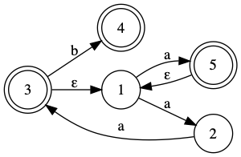

# Assignment 1

<div style="border:thin solid red; padding: 20px; color: red">
  <p style="margin:0; padding: 0">Your submission will be processed by source code analyzers
  for plagiarism.  You <b>must</b> work on your own assignment
  <b>individually</b>.  Sharing code is strictly prohibited.</p>
</div>

## Part 1: Write a lexer grammar according to the given Java token types.

Consider the following token types that apply to the Java programming langugage:


- `KEYWORD_<name>` where `<name>` can be
  any one of: `import`, `public`, `class`, ...
  https://en.wikipedia.org/wiki/List_of_Java_keywords

- puntuations:
  '=', `<`, `>`, `(`, `)`, `[`, `]`, `{`, `}`, `;`

- arithmetic operators
  `+`, `-`, `*`, `/`, `%`

- identifier
  > - main
  > - Arrays
  > - asList

- member
  > - `.out`
  > - `.println`

- numbers
  > - 123
  > - 123.456F
  > - 3.1415f

- strings
  > - "hello"
  > - "name is \\"Albert Einstein\\""

- comments
  > ```
  > // single line comment
  > ```

- block comment
  > ```
  > /* 
  > This is a mult-line
  > block comment.
  > */
  > ```

You are to implement a Java lexer using Antlr.

1. Author the Antlr .g4 lexer grammar.

2. Using the generated lexer, implement a function:
   ```java
   public static Stream<MyToken> analyze(String filename)
   ```
   where `MyToken` is a simple class:
   ```java
   class MyToken {
     String tokenType;
     String lexeme;
   }
   ```

3. Your implementation needs to be part of `Main.java`,
   and it needs to pass all the unit tests in `Test1.java`.

**Note:**
_Additional tests may be done during the grading of your assignment._


## Part 2: NFA Simulation

Provide an implementation of NFA.
```java
public class NFA {
  public NFA addStates(int... states);
  public NFA start(int state);
  public NFA transition(int start, int end, char symbol);
  public NFA epsilon(int start, int end);
  public NFA finalStates(int... states);
  public boolean accept(String input);
}
```

The `NFA` class provides an API to build arbitrary NFA with
epsilon-transitions.

Here is an example of how NFA should work.

> Consider the following NFA.
>
> </img>
> 
> The initial state is `1`, and the final states are `{3, 4, 5}`.  This can be
> represented as:
> 
> ```java
> NFA A = new NFA()
>     .addStates(1,2,3,4,5)
>     .start(1)
>     .transition(1, 2, 'a')
>     .transition(2, 3, 'a')
>     .epsilon(3, 1)
>     .transition(3, 4, 'b')
>     .transition(1, 5, 'a')
>     .epsilon(5, 1)
>     .finalStates(3, 4, 5);
> 
> String s = "aaaab";
> if(A.accept(s))
>   System.out.println("Accepted.");
> else
>   System.out.println("Not accepted.");
> ```

**Note**: _Additional tests may be done during grading_.

# Implementation, Testing and Submission

1. Clone (or download) this repository.

1. Modify the following files to implement your work.

    - src/main/antlr/JLexer.g4
    - src/main/java/Main.java
    - src/main/java/NFA.java

  You must not modify the files in src/test

2. You can use `gradle test` to run the tests.  For your convenience, we have
   included a `Makefile` so you can test the two parts of the assignment 
   separately by `make part1` and `make part2` separately.

3. You are to _submit_ the project directory (containing the build.gradle file)
   as a single .zip file to Blackboard.com.  **No other compression format will be supported.**
